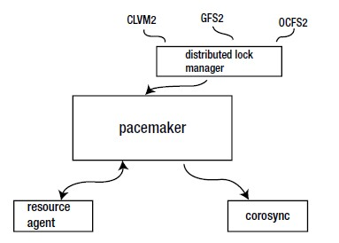
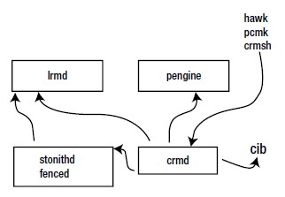

### 1. Giới thiệu chung
Pacemaker là thành phần trong cluster đảm trách việc quản lý tài nguyên (resource management)




#### 1.1. Resource Agents
Để thực hiện việc quản lý, nó sử dụng các resource agents. Resource agents là một script cluster dùng để start, stop, giám sát resources. Resource agent cũng định nghĩa các thành phần được quản lý bởi cluster.

#### 1.2. Corosync/cman
Corosync là lớp quản lý node membership, Pacemaker nhận cập nhật về các thay đổi trong trạng thái cluster membership, dựa vào đó để kích hoạt các sự kiện, vd như di dời resource.


#### 1.3. Storage layer
Pacemaker có thể được sử dụng để quản lý các thiết bị lưu trữ chia sẻ (shared storage devices). Để làm được điều này, cần phải sử dụng một thành phần quản lý lock phân tán (distributed lock manager_DLM). DLM đảm trách việc đồng bộ lock giữa các thiết bị lưu trữ, điều này đặc biệt quan trọng nếu lưu trữ chia sẻ được sử dụng, VD như cLVM2 clusterd logical volumes hoặc GSF2 và OCF2 clustered file systems.

### 2. Thành phần



Trong Pacemaker, các thành phần giao tiếp với nhau để quyết định resource nào được chạy

#### 2.1. Cluster Information Base (CIB)
Đây là trái tim của cluster. Trạng thái này luôn chạy ở in-memory, tiếp tục đồng bộ giữa các node trong cluster. Với một cluster administrator, không cần thiết phải sửa đổi CIB, nhưng đây sẽ là nguồn thông tin quan trọng khi cần debug.

Định dạng của CIB có các trường như sau:
```
<configuration>
<crm_config>
..
</crm_config>
<nodes>
..
</nodes>
<resources>
<primitive>
..
</primitive>
</configuration>
<status>
..
</status>
```
Trong CIB có 2 phần chính. Phần 1 chứa các thông tin cấu hình hệ thống, phần sau chứa các thông tin trạng thái. Trong phần cấu hình, có 3 phần chính.
Đầu tien là `crm_config`, phần này chứa các thông số cấu hình áp dụng cho toàn bộ Pacemaker.
```
<crm_config>
      <cluster_property_set id="cib-bootstrap-options">
        <nvpair id="cib-bootstrap-options-dc-version" name="dc-version" value="1.1.10-42f2063"/>
        <nvpair id="cib-bootstrap-options-cluster-infrastructure" name="cluster-infrastructure" value="corosync"/>
        <nvpair name="no-quorum-policy" value="ignore" id="cib-bootstrap-options-no-quorum-policy"/>
        <nvpair name="stonith-enabled" value="false" id="cib-bootstrap-options-stonith-enabled"/>
      </cluster_property_set>
    </crm_config>
```
Tiếp là phần `<node>`, ở đây chứa các thông tin về tất cả các node trong cluster. 
```
 <nodes>
      <node id="1" uname="controller1.test"/>
      <node id="2" uname="controller2.test"/>
      <node id="3" uname="controller3.test"/>
    </nodes>
```
Cuối cùng là phần resources, định nghĩa tất cả các resources được quản lý bởi cluster.
```
<resources>
      <primitive id="p_haproxy" class="ocf" provider="fuel" type="ns_haproxy">
        <operations>
          <op name="monitor" interval="30" timeout="60" id="p_haproxy-monitor-30"/>
          <op name="start" interval="0" timeout="60" id="p_haproxy-start-0"/>
          <op name="stop" interval="0" timeout="60" id="p_haproxy-stop-0"/>
        </operations>
        <instance_attributes id="p_haproxy-instance_attributes">
          <nvpair name="ns" value="haproxy" id="p_haproxy-instance_attributes-ns"/>
          <nvpair name="debug" value="true" id="p_haproxy-instance_attributes-debug"/>
          <nvpair name="other_networks" value="172.16.69.0/24" id="p_haproxy-instance_attributes-other_networks"/>
        </instance_attributes>
        <meta_attributes id="p_haproxy-meta_attributes">
          <nvpair name="migration-threshold" value="3" id="p_haproxy-meta_attributes-migration-threshold"/>
          <nvpair name="failure-timeout" value="120" id="p_haproxy-meta_attributes-failure-timeout"/>
          <nvpair name="target-role" value="Started" id="p_haproxy-meta_attributes-target-role"/>
        </meta_attributes>
      </primitive>
      <primitive id="vip__public" class="ocf" provider="fuel" type="ns_IPaddr2">
        <operations>
          <op name="monitor" interval="5" timeout="20" id="vip__public-monitor-5"/>
          <op name="start" interval="0" timeout="30" id="vip__public-start-0"/>
        </operations>
        <instance_attributes id="vip__public-instance_attributes">
          <nvpair name="bridge" value="br-ex" id="vip__public-instance_attributes-bridge"/>
          <nvpair name="base_veth" value="v_public" id="vip__public-instance_attributes-base_veth"/>
          <nvpair name="ns_veth" value="b_public" id="vip__public-instance_attributes-ns_veth"/>
          <nvpair name="ip" value="172.16.69.190" id="vip__public-instance_attributes-ip"/>
          <nvpair name="iflabel" value="ka" id="vip__public-instance_attributes-iflabel"/>
          <nvpair name="cidr_netmask" value="24" id="vip__public-instance_attributes-cidr_netmask"/>
          <nvpair name="ns" value="haproxy" id="vip__public-instance_attributes-ns"/>
          <nvpair name="gateway_metric" value="10" id="vip__public-instance_attributes-gateway_metric"/>
          <nvpair name="gateway" value="172.16.69.1" id="vip__public-instance_attributes-gateway"/>
        </instance_attributes>
        <meta_attributes id="vip__public-meta_attributes">
          <nvpair name="migration-threshold" value="3" id="vip__public-meta_attributes-migration-threshold"/>
          <nvpair name="failure-timeout" value="60" id="vip__public-meta_attributes-failure-timeout"/>
          <nvpair name="resource-stickiness" value="1" id="vip__public-meta_attributes-resource-stickiness"/>
        </meta_attributes>
      </primitive>
    </resources>
```

Phần thứ 2 của CIB là phần dài nhất. Nó chứa thông tin trạng thái hiện thời về các resource trong cluster. Nó chỉ ra chuyện gì đang xảy ra trong cluster, đây là các thông tin debug quan trong cho administrator.

```
  <status>
    <node_state id="1" uname="controller1.test" in_ccm="true" crmd="online" crm-debug-origin="post_cache_update" join="membe
r" expected="member">
      <transient_attributes id="1">
        <instance_attributes id="status-1">
          <nvpair id="status-1-probe_complete" name="probe_complete" value="true"/>
        </instance_attributes>
      </transient_attributes>
      <lrm id="1">
        <lrm_resources>
          <lrm_resource id="vip__public" type="ns_IPaddr2" class="ocf" provider="fuel">
            <lrm_rsc_op id="vip__public_last_0" operation_key="vip__public_start_0" operation="start" crm-debug-origin="buil
d_active_RAs" crm_feature_set="3.0.7" transition-key="8:0:0:63427bb5-fc45-4ec4-bcff-6bda4cea328a" transition-magic="0:0;8:0:
0:63427bb5-fc45-4ec4-bcff-6bda4cea328a" call-id="13" rc-code="0" op-status="0" interval="0" last-run="1482382805" last-rc-ch
ange="1482382805" exec-time="2259" queue-time="0" op-digest="329944f45c1747f8e7b40056cddfbf36"/>
            <lrm_rsc_op id="vip__public_monitor_5000" operation_key="vip__public_monitor_5000" operation="monitor" crm-debug
-origin="build_active_RAs" crm_feature_set="3.0.7" transition-key="9:0:0:63427bb5-fc45-4ec4-bcff-6bda4cea328a" transition-ma
gic="0:0;9:0:0:63427bb5-fc45-4ec4-bcff-6bda4cea328a" call-id="18" rc-code="0" op-status="0" interval="5000" last-rc-change="
1482382807" exec-time="7341" queue-time="0" op-digest="79248110b682501e477076f60d1d590a"/>
          </lrm_resource>
          <lrm_resource id="p_haproxy" type="ns_haproxy" class="ocf" provider="fuel">
            <lrm_rsc_op id="p_haproxy_last_0" operation_key="p_haproxy_start_0" operation="start" crm-debug-origin="build_ac
tive_RAs" crm_feature_set="3.0.7" transition-key="6:0:0:63427bb5-fc45-4ec4-bcff-6bda4cea328a" transition-magic="0:0;6:0:0:63
427bb5-fc45-4ec4-bcff-6bda4cea328a" call-id="16" rc-code="0" op-status="0" interval="0" last-run="1482382807" last-rc-change
="1482382807" exec-time="10830" queue-time="0" op-digest="ac7d804ed00c9fc5f1e970abf8e5c6df" op-force-restart=" dummy " op-re
start-digest="f2317cad3d54cec5d7d7aa7d0bf35cf8"/>
            <lrm_rsc_op id="p_haproxy_monitor_30000" operation_key="p_haproxy_monitor_30000" operation="monitor" crm-debug-o
rigin="build_active_RAs" crm_feature_set="3.0.7" transition-key="7:0:0:63427bb5-fc45-4ec4-bcff-6bda4cea328a" transition-magi
c="0:0;7:0:0:63427bb5-fc45-4ec4-bcff-6bda4cea328a" call-id="22" rc-code="0" op-status="0" interval="30000" last-rc-change="1
482382818" exec-time="736" queue-time="0" op-digest="4b97ee03eebf841c64253ce90572a0e6"/>
          </lrm_resource>
        </lrm_resources>
      </lrm>
    </node_state>
    <node_state id="2" uname="controller2.test" crmd="online" join="down" crm-debug-origin="post_cache_update" in_ccm="true"
/>
    <node_state id="3" uname="controller3.test" crmd="online" join="down" crm-debug-origin="post_cache_update" in_ccm="true"
/>
  </status>
```

